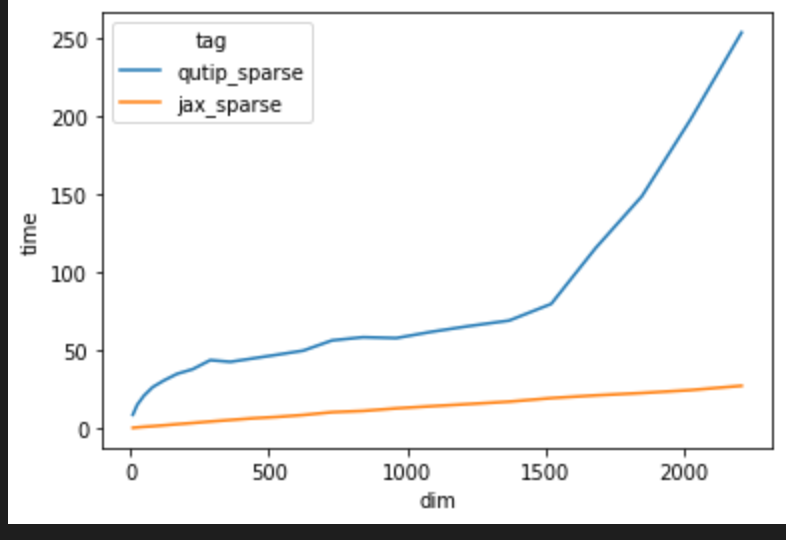

# Summary

<!-- The forces on stars, galaxies, and dark matter under external gravitational
fields lead to the dynamical evolution of structures in the universe. The orbits
of these bodies are therefore key to understanding the formation, history, and
future state of galaxies. The field of "galactic dynamics," which aims to model
the gravitating components of galaxies to study their structure and evolution,
is now well-established, commonly taught, and frequently used in astronomy.
Aside from toy problems and demonstrations, the majority of problems require
efficient numerical tools, many of which require the same base code (e.g., for
performing numerical orbit integration). -->

In the field of quantum physics, numerical models of systems often are built around differential equations. Modeling the evolution of quantum systems is a slow and difficult process, which explodes in difficulty as the dimensionality of these systems grows. Modeling quantum systems is a basic research need for many branches of quantum physics research, most notably quantum computing. By improving quantum dynamics simulation, we can improve the design of quantum computing devices, as well as the performance of devices across a huge range of different applications. Quantum dynamics modeling is important generally across the space of quantum physics research, and rely on the same basic numerical tools. These numerical tools must be efficient in order to allow for larger simulations, and repetative parameter searches.

We introduce Qiskit Dynamics, an open-source project for building, transforming, and solving models of quantum systems in Qiskit.

The goal of Qiskit Dynamics is to provide access to different numerical methods, and to automate common processes typically performed by hand, e.g. entering rotating frames, or doing the rotating wave approximation.

# Statement of need

<!-- `Gala` is an Astropy-affiliated Python package for galactic dynamics. Python
enables wrapping low-level languages (e.g., C) for speed without losing
flexibility or ease-of-use in the user-interface. The API for `Gala` was
designed to provide a class-based and user-friendly interface to fast (C or
Cython-optimized) implementations of common operations such as gravitational
potential and force evaluation, orbit integration, dynamical transformations,
and chaos indicators for nonlinear dynamics. `Gala` also relies heavily on and
interfaces well with the implementations of physical units and astronomical
coordinate systems in the `Astropy` package [@astropy] (`astropy.units` and
`astropy.coordinates`). -->

As the blank has grown and exploded, the need for efficient quantum simulations has grown. Quantum dynamics simulations are important for research and increasingly for products developed by quantum computing companies. As  research goals have expanded, robust and fast quantum simulation backends have become increasingly important. Currently many researchers choose to use their own purpose-built software for dynamics simulations, or are forced to use higher level tools which may not enable them to have the speed or control they need. In addition, these simulations lack the ability to utilize the crazy performance leaps in classical computing through GPU acceleration.   

Qiskit Dynamics is purpose-built to enable quantum system simulations to use a Jax backend. Google developed Jax to bring together [Autograd](https://github.com/hips/autograd) and [XLA](https://www.tensorflow.org/xla) for machine learning research. The result is a backend which enables fast computation, easily executable on GPUs, while also enabling full automatic differentiation. Any equations modeled in dynamics are automatically differentiated. This autodifferentiation is very important for quantum dynamics research. It massively accelerates gradient-based quantum control, and any general quantum simulation problem which requires differentiation. While there are tools that exist for general quantum systems simulation, Qiskit Dyanmics is designed for the power user who needs to run many simulations or large simulations and will benefit from the huge potential speedup. In addition, the autodifferenntiable nature of Qiskit Dynamics is very important for optimal control research, as well as general problems in the space. Combined with special tools for signals, frame transformations, the ability to easily choose solvers with one line, Qiskit Dynamics represents a powerful tool for researchers and developers who need to be able to push quantum dynamics simulations to their limits.

<!-- `Gala` was designed to be used by both astronomical researchers and by
students in courses on gravitational dynamics or astronomy. It has already been
used in a number of scientific publications [@Pearson:2017] and has also been
used in graduate courses on Galactic dynamics to, e.g., provide interactive
visualizations of textbook material [@Binney:2008]. The combination of speed,
design, and support for Astropy functionality in `Gala` will enable exciting
scientific explorations of forthcoming data releases from the *Gaia* mission -->
<!-- [@gaia] by students and experts alike. -->
# Comparison with other tools

In the quantum computing space, there are a number of tools for simulating quantum dynamics. Many researchers use their own home-grown tools, but the most widely used platform is QuTiP. According to their website, "QuTiP aims to provide user-friendly and efficient numerical simulations of a wide variety of Hamiltonians." QuTiP is a powerful and important tool in the quantum computing research community, and Qiskit Dynamics is not intended as a universal replacement for QuTiP. The core of Qiskit Dynamics is its usage of JAX, a library built by Google for making python functions automatically differentiable and capable of running on GPUs. Using Jax, Qiskit Dynamics enables users to obtain massive speedups on dynamics simulations, by utilizing GPUs. In addition, Qiskit Dynamics allows for easy implementation of certain Quantum Computing transformations, namely the Rotating Frame Transformation and the Rotating Wave Approximation, which can both be implemented in one line. Due to the completely differentiable nature of Qiskit Dynamics, transformations like these are easily implemented, whereas in a tool such as qutip these transformations must be done manually by the user, who must model the transformation themself.

By using Qiskit Dynamics instead of QuTiP, power users are able to massively accelerate their computations, take advantages of autodifferentiation, and use one-liners to perform rotating frame transformations and change the backend solvers. These tools enable Jax to utilize a GPU to increase performance over the single threaded qutip \ref{fig:jvq_sparse}

# Mathematics

Single dollars ($) are required for inline mathematics e.g. $f(x) = e^{\pi/x}$

Double dollars make self-standing equations:

$$\Theta(x) = \left\{\begin{array}{l}
0\textrm{ if } x < 0\cr
1\textrm{ else}
\end{array}\right.$$

You can also use plain \LaTeX for equations
\begin{equation}\label{eq:fourier}
\hat f(\omega) = \int_{-\infty}^{\infty} f(x) e^{i\omega x} dx
\end{equation}
and refer to \autoref{eq:fourier} from text.

# Citations

Citations to entries in paper.bib should be in
[rMarkdown](http://rmarkdown.rstudio.com/authoring_bibliographies_and_citations.html)
format.

If you want to cite a software repository URL (e.g. something on GitHub without a preferred
citation) then you can do it with the example BibTeX entry below for @fidgit.

For a quick reference, the following citation commands can be used:
<!-- - `@author:2001`  ->  "Author et al. (2001)"
- `[@author:2001]` -> "(Author et al., 2001)"
- `[@author1:2001; @author2:2001]` -> "(Author1 et al., 2001; Author2 et al., 2002)" -->

# Figures

Figures can be included like this:

<!--  -->

and referenced from text using \autoref{fig:jvq_sparse}.

Figure sizes can be customized by adding an optional second parameter:
{ width=20% }

# Acknowledgements

We acknowledge contributions from Many Good Friends

# References